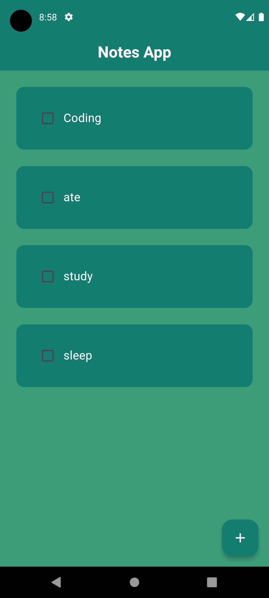
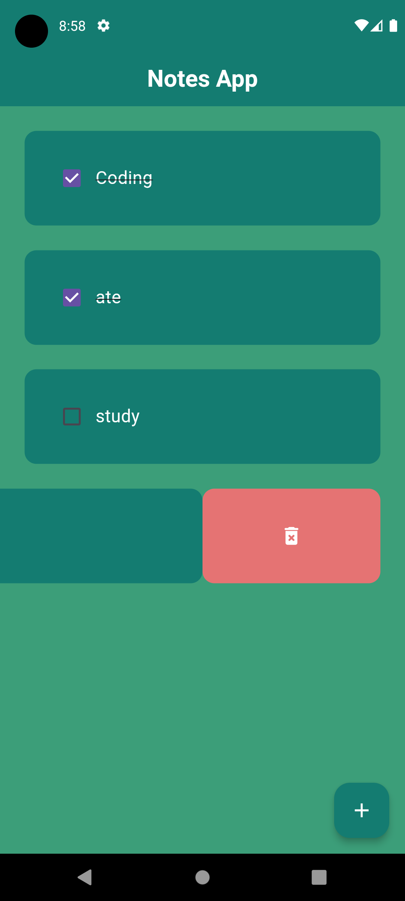
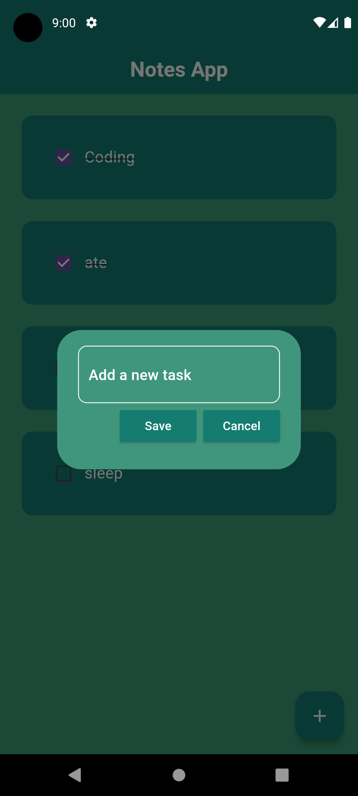

# Notes Application

## Overview

The Notes Application is a simple and intuitive app developed by Idham Atta. It allows users to create, manage, and delete tasks efficiently. This application is built using Flutter and leverages modern design principles to provide a clean and user-friendly interface.

## Features

- **Task Creation:** Users can add new tasks easily with a simple input field.
- **Task Completion:** Users can mark tasks as completed with a checkbox.
- **Task Deletion:** Users can remove tasks with a swipe action.
- **Persistency:** The application retains tasks between sessions.

## Screenshots

<!-- Add paths to your screenshots here -->



## Installation

To get started with the Notes Application, follow these steps:

1. **Clone the Repository:**

    ```sh
    git clone https://github.com/your-username/notes_app.git
    ```

2. **Navigate to the Project Directory:**

    ```sh
    cd notes_app
    ```

3. **Install Dependencies:**

    ```sh
    flutter pub get
    ```

4. **Run the Application:**

    ```sh
    flutter run
    ```

## Usage

- **Add a New Task:** Click the '+' button at the bottom right corner, enter the task in the input field, and press 'Save'.
- **Mark Task as Completed:** Tap the checkbox next to the task.
- **Delete a Task:** Swipe the task to the left and click the delete icon.

## Code Structure

The main components of the application are structured as follows:

- **main.dart:** Entry point of the application.
- **home_page.dart:** Contains the main logic and UI for displaying tasks.
- **todo_tile.dart:** Widget for individual task tiles.
- **dialog_box.dart:** Custom dialog for adding new tasks.

## Contributing

Contributions are welcome! Please fork the repository and submit a pull request with your changes. Ensure that your code address to the project's coding standards and includes appropriate tests.

## Contact

For any questions or suggestions, feel free to contact Idham Atta at idhamatta2706@gmail.com.
